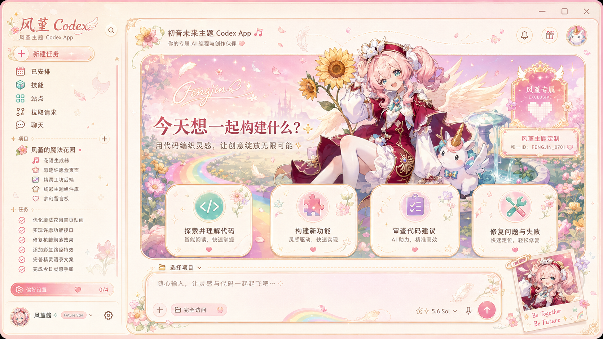

# Codex Dream Skin · 风堇 Windows 主题版

> 为官方 Microsoft Store 版 OpenAI Codex 提供可恢复的 Windows 外部主题。通过本机回环 CDP 注入 CSS，不修改 WindowsApps、`app.asar`、应用二进制或签名。

[English](./README.en.md) · [Windows 使用说明](./windows/README.zh-CN.md) · [上游来源与署名](./UPSTREAM.md) · [MIT License](./LICENSE)

## 风堇 · 魔法花园 V2

<p align="center">
  
</p>

V2 根据参考布局重新设计：角色主视觉、花园徽章、四张嵌入式功能卡、彩色 SVG 图标、侧栏品牌、花瓣轨迹、项目栏、输入框和拍立得保持统一的奶油粉金视觉。侧栏、建议卡、项目选择和输入框依然是 Codex 的真实控件，不是整窗截图覆盖。

## 快速安装

### 1. 准备环境

- Windows 10/11
- Microsoft Store 安装的官方 `OpenAI.Codex`
- Node.js 22 或更高版本
- PowerShell 5.1 或更高版本

### 2. 安装换肤引擎

完全关闭 Codex，打开 PowerShell 并进入本仓库：

```powershell
cd .\windows
powershell -NoProfile -ExecutionPolicy Bypass -File .\scripts\install-dream-skin.ps1
```

安装后桌面会出现启动、定制和恢复快捷方式。

### 3. 安装并启用风堇 V2

```powershell
$theme = ".\theme-packs\hyacine-fengjin-magic-garden-v2"
$target = Join-Path $env:LOCALAPPDATA "CodexDreamSkin\themes\hyacine-fengjin-magic-garden-v2"
New-Item -ItemType Directory -Force -Path (Split-Path $target) | Out-Null
Copy-Item -LiteralPath $theme -Destination $target -Recurse -Force
.\scripts\switch-theme-windows.ps1 -Id hyacine-fengjin-magic-garden-v2 -PromptRestart
```

随后从 **Codex Dream Skin** 桌面快捷方式启动 Codex。

## 使用与切换

列出本机主题：

```powershell
.\windows\scripts\switch-theme-windows.ps1 -List
```

启用风堇 V2：

```powershell
.\windows\scripts\switch-theme-windows.ps1 -Id hyacine-fengjin-magic-garden-v2 -PromptRestart
```

使用自己的图片创建主题：

```powershell
.\windows\scripts\customize-theme-windows.ps1 `
  -ImagePath "C:\Pictures\background.png" `
  -Id "my-theme" `
  -Name "我的主题"
```

创建器会将图片复制到 `%LOCALAPPDATA%\CodexDreamSkin\themes`，并为 PNG/JPEG 自动提取调色板和基础布局。`theme.json` 仍可手动调整焦点、横幅高度、圆角、装饰和主题文案。

恢复官方外观：

```powershell
.\windows\scripts\restore-dream-skin.ps1 -RestoreBaseTheme -PromptRestart
```

恢复会移除注入和调试会话，但不会删除你已创建的个人主题。

## 安全与边界

- CDP 只绑定到 `127.0.0.1`；主题运行期间不要运行不可信的本机程序。
- 不修改官方安装目录、签名、`app.asar` 或 API Key / Base URL。
- 主题图片和角色素材的权利由各自权利人保留；公开再分发或商用前请确认授权。
- 本项目不是 OpenAI 官方产品，也未获 OpenAI 认可或赞助。

## 上游来源与署名

本仓库是基于 [Fei-Away/Codex-Dream-Skin](https://github.com/Fei-Away/Codex-Dream-Skin) 的 Windows 主题衍生项目。保留上游 MIT 许可证与原有声明；详情见 [UPSTREAM.md](./UPSTREAM.md)。感谢原仓库作者和贡献者提供基础项目。

## 验证与开发

```powershell
cd .\windows
powershell -NoProfile -ExecutionPolicy Bypass -File .\tests\run-tests.ps1
.\scripts\verify-dream-skin.ps1 -ScreenshotPath "$env:TEMP\dream-skin.png"
```

## 许可证

软件源码采用 [MIT License](./LICENSE)。主题内示例图片不随 MIT 授权，详见 [NOTICE.md](./NOTICE.md)。
